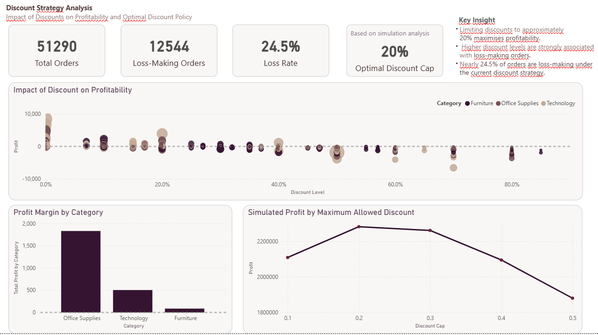
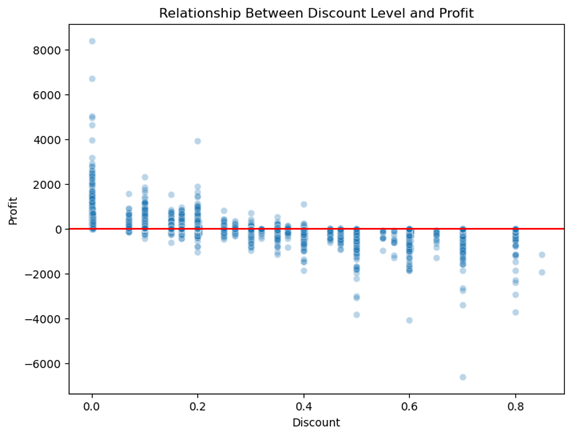
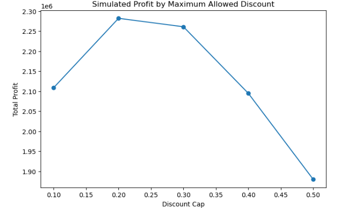

# Discount Strategy Analysis (Python & Power BI)

Python | Pandas | Seaborn | Statsmodels | Power BI | Data Analysis | Business Analytics


The dashboard summarises insights generated through Python analysis and simulation modelling.

## Overview

This project analyses the impact of discount levels on sales profitability using the Global Superstore dataset.

The objective was to investigate how discount strategies influence profit outcomes and to identify an optimal discount policy that maximises overall profitability.

The analysis combines Python-based data exploration and modelling with a Power BI dashboard designed to communicate the findings in a business-friendly format.


## Business Context

Retail organisations frequently use discounts to stimulate demand and increase sales volume.  
However, excessive discounting can significantly reduce profitability.

Understanding the relationship between discount levels and profit outcomes is therefore critical for developing effective pricing and promotional strategies.

This analysis explores how discount policies affect profitability and evaluates potential discount limits using scenario simulation.


## Dataset

Source: Global Superstore dataset

Type: Transactional retail sales data

Includes:

• Sales  
• Profit  
• Discount levels  
• Product categories  
• Customer segments  
• Regions and markets  
• Order and shipping information  

The dataset contains 51,290 sales transactions and was prepared and analysed using Python.


## Tools & Technologies

Python (Pandas, Matplotlib, Seaborn, Statsmodels)
Jupyter Notebook
Power BI


## Analysis Performed

The analysis was conducted in several stages:

• Exploratory data analysis of sales, profit and discount distributions  
• Identification of loss-making orders  
• Analysis of the relationship between discount levels and profitability  
• Scenario simulation testing different maximum discount policies  
• Regression modelling to estimate the impact of discounts on profit  


### Discount vs Profit relationship




### Discount Cap Simulation




## Dashboard

A Power BI dashboard was created to communicate the findings and support business interpretation.

The dashboard includes:

• Key business metrics (orders, loss-making orders, loss rate)  
• Discount vs Profit relationship analysis  
• Profitability comparison across product categories  
• Simulation of different discount cap scenarios  


## Analytical Approach

Python was used to explore discount behaviour, identify loss-making orders, and simulate different discount cap scenarios. 
The results were then communicated through a Power BI dashboard designed for business interpretation.

## Key Business Insights

The analysis revealed several important findings:

• Approximately **24.5% of orders are loss-making**  
• Higher discount levels are strongly associated with negative profit outcomes  
• Allowing excessive discounts significantly reduces overall profitability  
• Limiting discounts to approximately **20% maximises total profit**  


## Repository Structure

```
discount-strategy-analysis
│
├── screenshots
│   ├── dashboard_preview.png
│   ├── discount_vs_profit.png
│   └── discount_simulation.png
│
├── 01_discount_strategy_analysis.ipynb
├── discount_strategy_dashboard.pbix
├── superstore.xlsx
└── README.md
```

## Project Files

• `01_discount_strategy_analysis.ipynb` – Python analysis and modelling  
• `discount_strategy_dashboard.pbix` – Power BI dashboard  
• `superstore.xlsx` – dataset used for analysis

## About This Project

This project forms part of my professional data analytics portfolio and demonstrates practical Python-based analysis combined with Power BI dashboard development to generate business insights and decision-support recommendations.
